% CvilleBioHub and UVA BDS
% Nikki Hastings, Greg Medlock, Catherine Robertson, Sarah Goggin, Christopher Dampier
% June 19, 2019

## 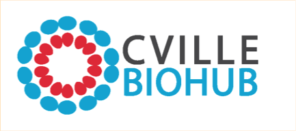
* Organized as a §501(c)(6) non-profit corporation
* [cvillebiohub.org](https://cvillebiohub.org/)

## Platform
CvilleBioHub is an open community network of over 60 companies that serves the community
to drive growth and sustainability of the biotech industry.

## Mission
To advance the Charlottesville-area biotechnology industry through *connection, collaboration, and elevation*

## Current updates
1. CvilleBioHub Strategic Plan is in review
2. Conducting Impact Study to collect data from our region (*in progress*)
3. Developing partnerships and collaborations
4. Hosting/co-hosting monthly professional development events
5. Aiming for sustainability through partnership, sponsorship, grants, conferences

## Future objectives
* To develop programs to directly impact the needs of the CvilleBioHub network.
* To assess and develop a plan for a Charlottesville-based incubator facility, to include wet-lab capabilities.
* To develop and grow a pipeline of talent and entities to sustain a vibrant and innovative biotechnology ecosystem.

## Biomedical Data Sciences Training Grant
* [bme.virginia.edu/bds/](http://bme.virginia.edu/bds/)
* Established 2016
* NIH-funded predoctoral training grant
* Focused on biomedical big data manipulation, analysis & interpretation

## Grant PI
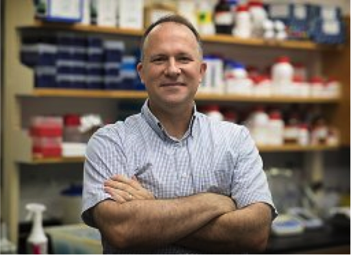

## Alumni

[bme.virginia.edu/bds/alumni.html](http://bme.virginia.edu/bds/alumni.html)

## Current trainees
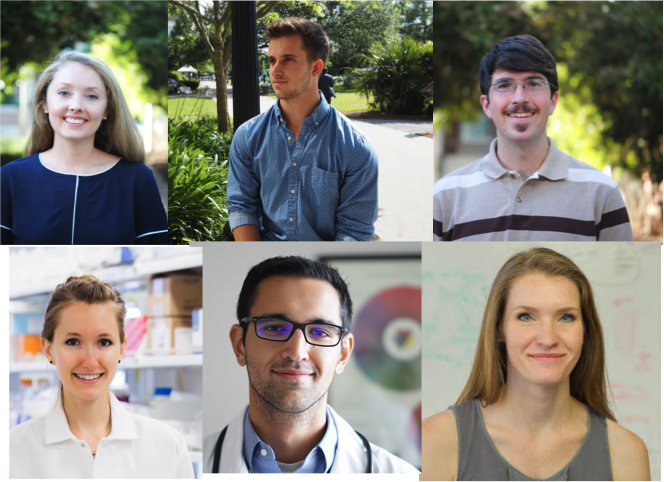
[bme.virginia.edu/bds/trainees.html](http://bme.virginia.edu/bds/trainees.html)

## Departments
* Biomedical Engineering
* Systems Engineering
* Computer Science
* Biochemistry & Molecular Genetics

## Research
* Computational epigenetics
* Gut microbiome metabolism
* Natural language processing for mental health
* Deep learning for genomics

## *Inaugural trainees now graduating and ready to be recruited*

## Key training activities
* Courses in machine learning, statistics, quantitative biology
* Collaborative research experiences and co-mentorship
* Hackathons, open participation for 2019, 20 hackers

## Hackathon organizers
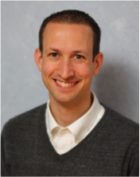

## Hackathon organizers

## Hackathon organizers

## Basics of biomedical science
* For an individual organism, there are many tissues and cells
* Same DNA, different characteristics and functions
* What determines the function and behavior of a cell?

## Basics of "omics" technologies

## NGS
* Next-Generation sequencing (NGS) is a tool to study molecular features of cells
* Traditionally performed on genetic material pooled from large groups of cells ("bulk" sequencing)

## NGS
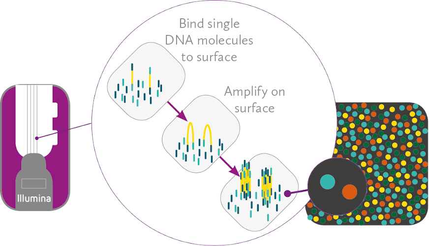

## Basics of "omics" technologies
* NGS generates LARGE datasets
* An expansive open source community develops tools for analyzing these data

## Single-cell technologies

## Motivation
* Bulk omics assays show averages of groups
* Miss important cell-to-cell heterogeneity

## Early single-cell expression
* [Brady, et al., 1990](http://wwwlabs.uhnresearch.ca/iscove/MMCB90.pdf) profile individual macrophages
* [Eberwine, et al., 1992](https://www.ncbi.nlm.nih.gov/pmc/articles/PMC48793/) profile individual neurons

## Single neuron
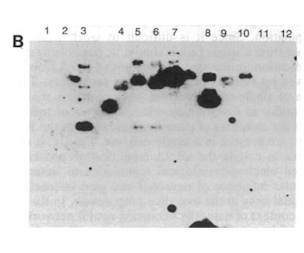

## Original single-cell RNA-seq
* [Tang, et al., 2009](https://www.nature.com/articles/nmeth.1315) profile individual mouse blastomeres and oocytes

## RNA-seq vs array
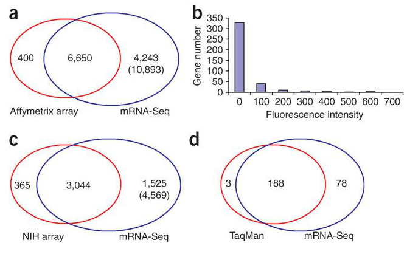

## Contemporary methods
* [Hwang, et al., 2018](https://www.nature.com/articles/s12276-018-0071-8) review single-cell RNA-seq methods
* Isolation: dilution, micromanipulation, FACS, LCM, microfluidics, CellSearch
* Library prep: [Smart-seq](https://www.ncbi.nlm.nih.gov/pmc/articles/PMC3467340/), [MARS-seq](https://science.sciencemag.org/content/343/6172/776), [CEL-seq](https://www.sciencedirect.com/science/article/pii/S2211124712002288?via%3Dihub), [Drop-seq](https://www.cell.com/abstract/S0092-8674(15)00549-8)

## Microfluidics
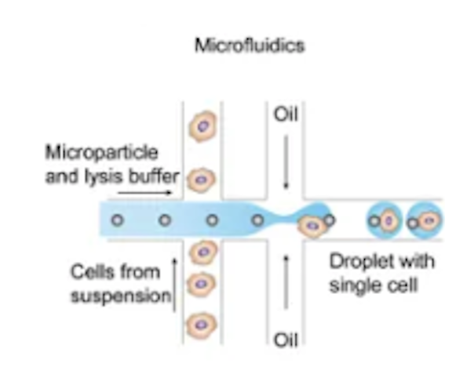

## Epigenomics
* [Smallwood, et al., 2014](https://www.nature.com/articles/nmeth.3035) introduce scBS-seq
* [Buenrostro, et al., 2015](https://www.nature.com/articles/nature14590) introduce scATAC-seq
* [Rotem, et al., 2015](https://www.nature.com/articles/nbt.3383) introduce scChIP-seq

## Methylation profile
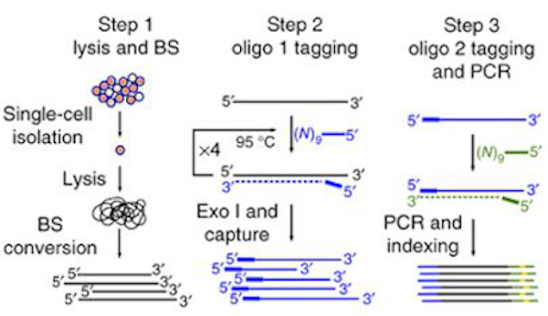

## Chromatin accessibility profile
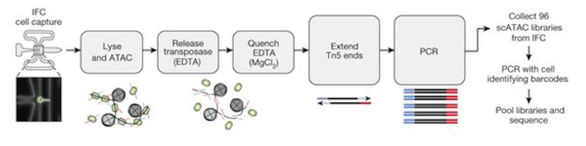

## Histone modification profile
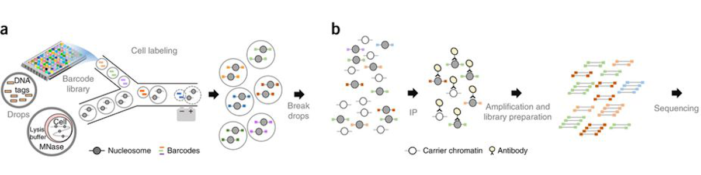

## Proteomics

## 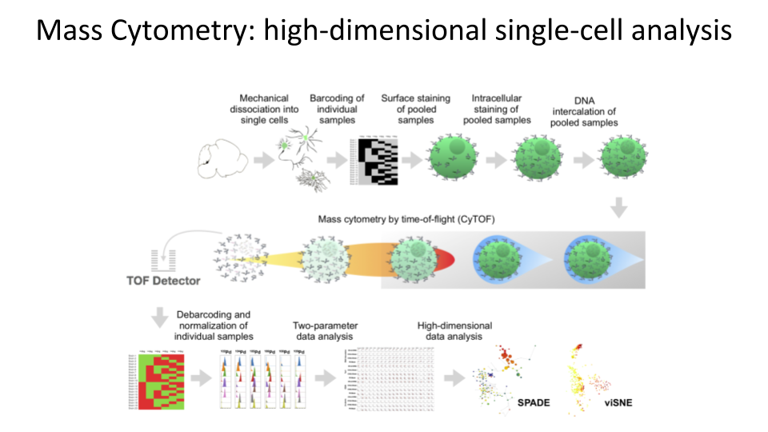

## Bioinformatics
"This area remains in its infancy..."

* [Hwang, et al., 2018](https://www.nature.com/articles/s12276-018-0071-8)

## Preprocessing
* Typical stuff (FastQC, STAR, featureCounts, kallisto/Salmon) *PLUS*
* Recover cell of origin with cell barcode sort
* Deduplicate transcripts with UMI filter

## 
[elveflow.com](https://www.elveflow.com/microfluidic-tutorials/microfluidic-reviews-and-tutorials/drop-seq/)

## Normalization
* Dropout and zero-inflated counts
* [Lun, et al., 2016](https://genomebiology.biomedcentral.com/articles/10.1186/s13059-016-0947-7)

## Confounding factors
* Cell cycle variability
* [Buettner, et al., 2015](https://www.nature.com/articles/nbt.3102)

## Analysis

## Hackathon 2019
Goal: To develop a convenient, free and open-source software tool to solve one of the many remaining bioinformatics challenges of single-cell molecular phenotyping

## Toolkit
* [Python](https://www.python.org/)
* [GitHub](https://github.com/databio/bdshack19) [*](https://octoverse.github.com/projects#languages)
* [PyPI](https://pypi.org/)

## 48 hours of glory

## In Rice Hall
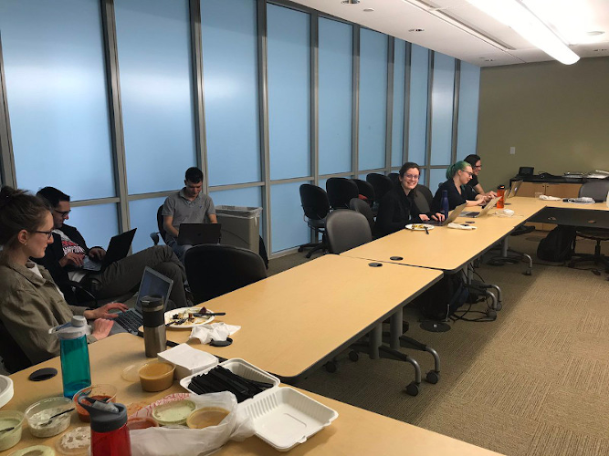

## [And on Twitter](https://twitter.com/kianfi13/status/1113921738893611008?s=20)

## Process
* Choose a dataset
* Distribute tasks
* Collaborate on GitHub
* [ScanPy](https://scanpy.readthedocs.io/en/stable/)
* [anndata](https://anndata.readthedocs.io/en/stable/)

## Product
* [MultiAnnData](https://github.com/databio/bdshack19/blob/master/mixsc/multimeasure.py)
* [MadPy](https://pypi.org/search/?q=MadPy) - MultiAnnData in Python
* [MoPy](https://pypi.org/search/?q=MoPy) - MultiOmics in Python
