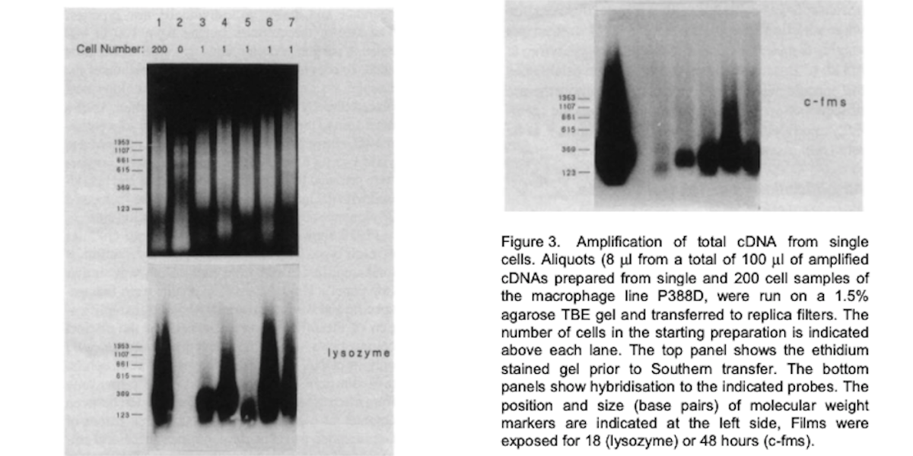
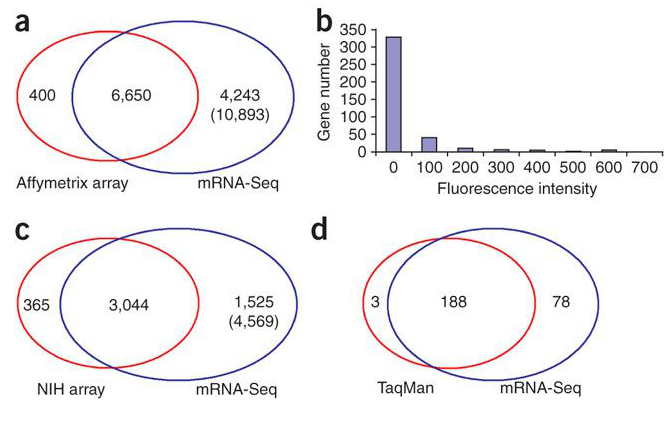
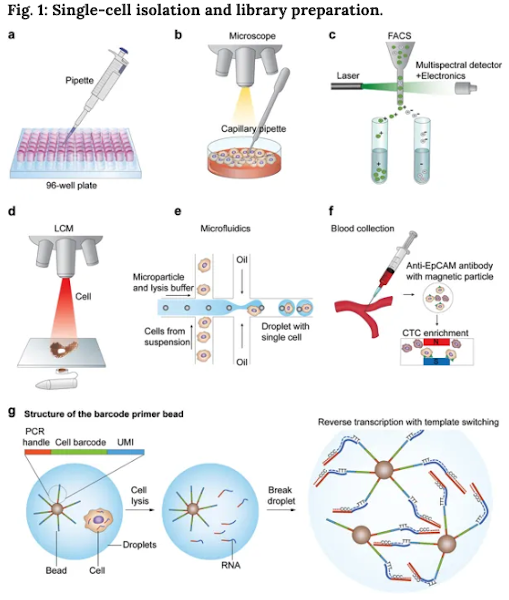
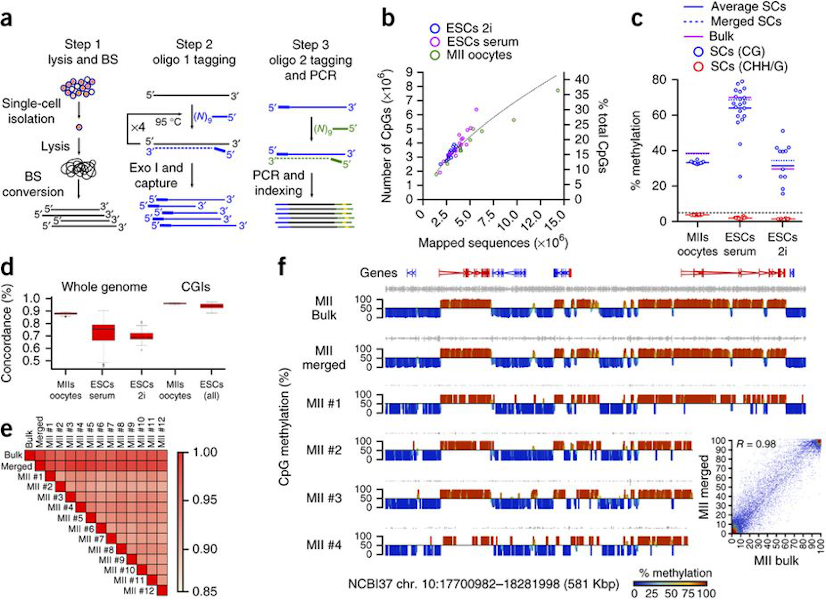
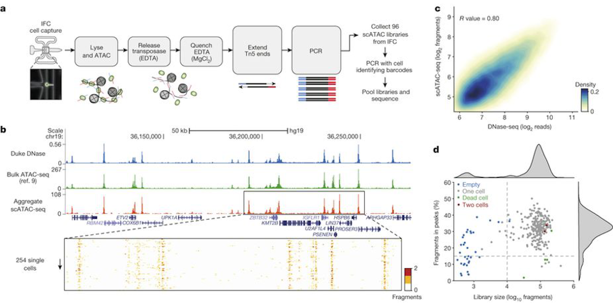
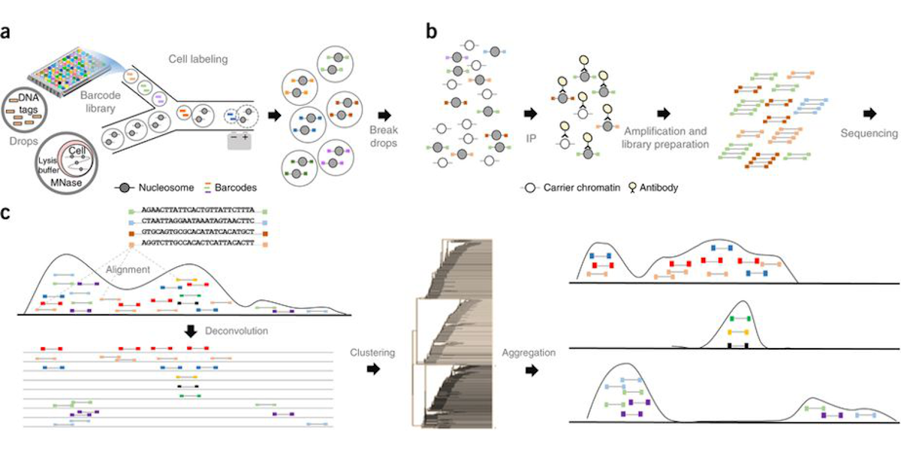
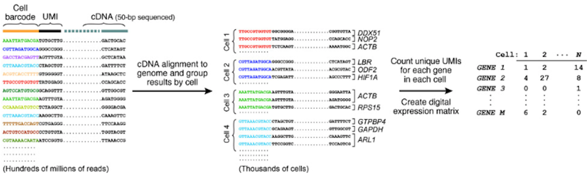

% BDS Hackathon 2019
% Nikki Hastings, Greg Medlock, Catherine Robertson, Sarah Goggin, Christopher Dampier
% June 19, 2019

## Biomedical Data Sciences Training Grant
* Goals
* Current trainees
* Alumni
* Hackathon

## Single-cell technologies

## Motivation
* For an individual organism, there are many cells
* All with same DNA
* But many with different characteristics
* Bulk omics assays present averages
* Miss important cell-to-cell heterogeneity

## Transcriptomics

## Early single-cell expression
* [Brady, et al., 1990](http://wwwlabs.uhnresearch.ca/iscove/MMCB90.pdf) profile individual macrophages
* [Eberwine, et al., 1992](https://www.ncbi.nlm.nih.gov/pmc/articles/PMC48793/) profile individual neurons

## 

## 

## Original single-cell RNA-seq
* [Tang, et al., 2009](https://www.nature.com/articles/nmeth.1315) profile individual mouse blastomeres and oocytes

## 

## Contemporary methods
* [Hwang, et al., 2018](https://www.nature.com/articles/s12276-018-0071-8) review single-cell RNA-seq methods
* Isolation: dilution, micromanipulation, FACS, LCM, microfluidics, CellSearch
* Library prep: [Smart-seq](https://www.ncbi.nlm.nih.gov/pmc/articles/PMC3467340/), [MARS-seq](https://science.sciencemag.org/content/343/6172/776), [CEL-seq](https://www.sciencedirect.com/science/article/pii/S2211124712002288?via%3Dihub), [Drop-seq](https://www.cell.com/abstract/S0092-8674(15)00549-8)

## 

## Epigenomics
* [Smallwood, et al., 2014](https://www.nature.com/articles/nmeth.3035) introduce scBS-seq
* [Buenrostro, et al., 2015](https://www.nature.com/articles/nature14590) introduce scATAC-seq
* [Rotem, et al., 2015](https://www.nature.com/articles/nbt.3383) introduce scChIP-seq

## 

## 

## 

## Proteomics

## 

## Bioinformatics
"This area remains in its infancy..."

* [Hwang, et al., 2018](https://www.nature.com/articles/s12276-018-0071-8)

## Preprocessing
* Typical stuff (FastQC, STAR, featureCounts, kallisto/Salmon) __PLUS__:
* Recover cell of origin with cell barcode sort
* Deduplicate transcripts with UMI filter

## 
[elveflow.com](https://www.elveflow.com/microfluidic-tutorials/microfluidic-reviews-and-tutorials/drop-seq/)

## Normalization
* Dropout and zero-inflated counts
* [Lun, et al., 2016](https://genomebiology.biomedcentral.com/articles/10.1186/s13059-016-0947-7)

## Confounding factors
* Cell cycle variability
* [Buettner, et al., 2015](https://www.nature.com/articles/nbt.3102)

## Analysis
* Example article

## Hackathon 2019
Goal: To develop a convenient, free and open-source software tool to solve one of the many remaining bioinformatics challenges of single-cell molecular phenotyping

## Toolkit
* [Python](https://www.python.org/)
* [GitHub](https://github.com/databio/bdshack19)
* [Languages on GitHub](https://octoverse.github.com/projects#languages)
* [PyPI](https://pypi.org/)
* [ScanPy](https://scanpy.readthedocs.io/en/stable/)
* [anndata](https://anndata.readthedocs.io/en/stable/)

## 48 hours of glory

## In Rice Hall

## [And on Twitter](https://twitter.com/kianfi13/status/1113921738893611008?s=20)

## Product
* [MultiAnnData](https://github.com/databio/bdshack19/blob/master/mixsc/multimeasure.py)
* [MadPy](https://pypi.org/search/?q=MadPy) - MultiAnnData in Python
* [MoPy](https://pypi.org/search/?q=MoPy) - MultiOmics in Python

## notes
* pandoc -t revealjs -s -o myslides.html myslides.md
* Presentation, 20 mins:
* Intro to single-cell sequencing and other omics technologies (technology background)...5 mins
* Intro to how technology is being used...5 mins
* Intro to Hackathon experience...5 mins
* Intro to product...5 mins
* cVilleBioHub...attached to Indoor BioTechnologies...Martin Chapman
* 700 Harris Street in Silk Mill Salon
